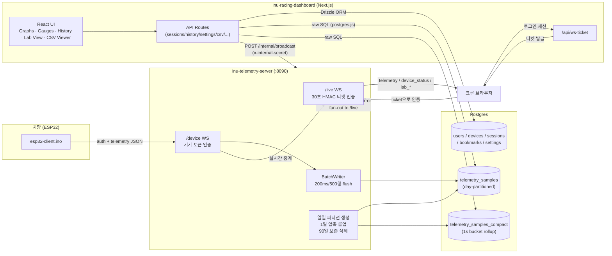

# INU Racing Telemetry

INU Racing Team 전기 킷카의 실시간 텔레메트리 대시보드 + WebSocket 인제스트 서버 모노레포.
실제 운영 환경: 대시보드 `https://inu.cortie.io`, 인제스트 서버 `https://telemetry.cortie.io`.

## 구성

| 디렉토리 | 역할 | 스택 |
|---|---|---|
| [`inu-telemetry-server/`](inu-telemetry-server) | 차량 ↔ 서버 WebSocket 인제스트, Postgres 배치 저장, `/live` 실시간 브로드캐스트 | Node.js, `ws`, `pg`, zod |
| [`inu-racing-dashboard/`](inu-racing-dashboard) | 크루가 보는 웹 대시보드 (로그인, 실시간 게이지/그래프, Lab 녹화·재생, History, CSV) | Next.js 16, React 19, Drizzle ORM, NextAuth |

두 서비스는 독립적으로 배포되는 별개의 프로세스이며, 코드 공유는 없다 — 이 리포는 편의상 하나로 묶은
모노레포일 뿐 각 디렉토리가 각자의 `package.json`/`node_modules`/배포 단위를 갖는다.

## 아키텍처



**핵심 설계 포인트**

- **저장과 실시간 전달이 분리된 경로**: `/device`로 들어온 프레임은 Postgres에 배치(200ms/500행)로
  쌓이는 동시에, 지연 없이 그대로 `/live` 구독자 전원에게 브로드캐스트된다. 하나가 느려져도 다른
  하나는 영향받지 않는다.
- **Postgres가 유일한 소스, `inu-telemetry-server`는 미러**: 세션(Lab) 시작/종료/북마크 같은 쓰기는
  전부 `inu-racing-dashboard`(Next.js API)가 Drizzle로 수행하고, 그 직후 `/internal/broadcast`로
  `inu-telemetry-server`에 알려 인메모리 `activeLab` 미러를 갱신 + `/live` 뷰어 전원에게 이벤트를
  중계한다. 서버 재시작 시에는 `loadOpenLab()`으로 DB에서 상태를 복원하므로 미러가 유실돼도
  자기 치유된다.
- **인증 방식이 두 엔드포인트마다 다르다**: `/device`는 재발급이 번거로운 하드웨어이므로 bcrypt
  해시로 저장된 장기 토큰(첫 메시지로 인증, 15초 타임아웃)을, `/live`는 브라우저 소스에 시크릿을
  남기면 안 되므로 로그인 세션으로 발급받는 30초짜리 1회용 HMAC 티켓(`/api/ws-ticket`)을 쓴다.
- **연결 상태 = 브라우저 연결 ∧ 차량 연결**: `/live` WebSocket이 열려 있다는 것과 차량이 `/device`에
  붙어 있다는 것은 별개 정보라, 서버가 `device_status` 메시지로 차량 연결 상태를 따로 브로드캐스트하고
  프론트(`use-telemetry.ts`)가 두 값을 AND로 합쳐 최종 온라인 상태를 계산한다.

## 데이터 볼륨 관리

지속적으로 흘러 들어오는 고빈도 텔레메트리가 무한정 쌓이지 않도록 3단계로 관리한다 (`db.ts`):

1. **파티셔닝** — `telemetry_samples`는 날짜별 range partition (BRIN 인덱스), 서버 부팅 시 +
   6시간마다 오늘/내일 파티션을 미리 생성.
2. **압축(1일 경과)** — 하루 넘은 raw 행을 device/session/초 단위로 묶어 평균·최대값만 남긴
   `telemetry_samples_compact`로 롤업하고 원본은 삭제 (3시간마다 실행, INSERT+DELETE가 같은
   WHERE 절로 한 트랜잭션 안에서 실행되어 별도 "처리 완료" 마킹이 필요 없음).
3. **보존(90일 경과)** — 두 테이블 모두에서 90일 지난 행 삭제.

**단, Lab Time(북마크)이 하나라도 있는 세션은 압축·삭제 대상에서 완전히 제외** — 크루가 표시해둔
구간은 90일 내내 원본 해상도로 남는다. `queryHistory()`는 raw+compact를 `sample_count` 가중
평균으로 `UNION`해서, 조회 구간이 압축 경계를 걸쳐도 하나의 연속된 시계열로 보이게 한다.

## WebSocket 프로토콜

전체 메시지 스펙(필드 단위/범위, 인증 흐름, 하트비트, 확장 체크리스트)은
[`inu-telemetry-server/PROTOCOL.md`](inu-telemetry-server/PROTOCOL.md)에 정리되어 있다 — 실제
동작과 문서가 어긋나면 [`src/protocol.ts`](inu-telemetry-server/src/protocol.ts)와
[`src/server.ts`](inu-telemetry-server/src/server.ts)가 기준.

텔레메트리 프레임은 9개 필드(steeringAngle/brakeFront/brakeRear/speed/batteryTemp/batteryVoltage/
batteryCurrent/rtd/preCharge)를 매 프레임 전부 채워 보내며, 값은 raw ADC가 아니라 이미 사람이 읽는
단위(도/%/km·h/°C/V/A)로 변환되어 전송된다.

## 데이터베이스 스키마

- `users`, `devices`, `sessions`, `bookmarks`, `settings` — Drizzle ORM으로 관리
  ([`db/schema.ts`](inu-racing-dashboard/db/schema.ts))
- `telemetry_samples`, `telemetry_samples_compact` — day-partitioning 때문에 Drizzle이 아닌 raw SQL로
  관리 ([`db/telemetry-schema.sql`](inu-racing-dashboard/db/telemetry-schema.sql),
  [`db/telemetry.ts`](inu-racing-dashboard/db/telemetry.ts))

```
users ──< sessions >── devices
           │
           └──< bookmarks   (Lab Time: start_ts~end_ts 구간)

devices ──< telemetry_samples >── sessions   (day-partitioned, BRIN)
devices ──< telemetry_samples_compact >── sessions   (1s bucket rollup)

settings   (singleton row, 팀 공용 배터리 위험 임계값)
```

## 대시보드 기능

- **실시간 Graphs / Gauges** — 6채널(속도·조향·전후 브레이크·배터리 온도·전압·전류) + 계산값 kW,
  10Hz로 렌더 스로틀링된 WebSocket 스트림.
- **Fullscreen 게이지 클러스터** — 인카 인스트루먼트 클러스터 스타일 전체화면 뷰(속도 아크, 시프트
  라이트, 파워/온도 카드).
- **Lab 녹화/재생** — Start/Stop으로 세션 기록, Start Mark/End Mark로 관심 구간(Lab Time)을
  구간(시작~끝)으로 마킹. 녹화 상태는 서버(인제스트 서버의 `/internal/broadcast` 미러)가
  단일 진실 공급원이라 동시에 여러 화면이 봐도 Start/Stop/마크가 항상 동기화된다.
- **History** — 기간별 조회(초/분/시간 단위 프리셋 + 커스텀 범위), 통계(평균/최고 속도, 최고 온도,
  RTD/프리차지 활성 비율).
- **Raw Data 탭** — `telemetry_samples` 원본을 페이지네이션으로 그대로 표시.
- **CSV Export/Import** — Lab 구간을 CSV로 다운로드하고, 별도의 Viewer 탭에서 CSV를 업로드해
  헤더 이름 기준으로 파싱 후 동일한 차트 컴포넌트로 재생.
- **팀 공용 위험 임계값 설정** — 배터리 온도/전압/전류 위험선을 DB에 저장해 크루 전체가 공유.

## 환경변수

값은 각 디렉토리의 `.env.local`(git에 커밋되지 않음)에 있다. 필요한 키 이름만 정리:

**`inu-telemetry-server/.env.local`**
`PORT`, `DATABASE_URL`, `WS_TICKET_SECRET`, `INTERNAL_API_SECRET`, `FLUSH_INTERVAL_MS`,
`FLUSH_MAX_ROWS`, `BUFFER_HARD_CAP`, `HEARTBEAT_INTERVAL_MS`, `AUTH_TIMEOUT_MS`, `TICKET_TTL_MS`

**`inu-racing-dashboard/.env.local`**
`DATABASE_URL`, `AUTH_SECRET`, `AUTH_URL`, `WS_TICKET_SECRET`, `INTERNAL_API_SECRET`,
`TELEMETRY_INGEST_URL`, `NEXT_PUBLIC_TELEMETRY_WS_URL`

`WS_TICKET_SECRET`과 `INTERNAL_API_SECRET`은 두 서비스가 반드시 동일한 값을 가져야 한다(HMAC
티켓 검증 / 내부 브로드캐스트 인증에 각각 쓰임).

## 로컬 개발

```bash
# 1) inu-telemetry-server
cd inu-telemetry-server
npm install
npm run dev              # tsx watch src/server.ts, :8090

# 실제 하드웨어 없이 테스트하려면 (별도 터미널)
DEVICE_KEY=esp32-01 DEVICE_TOKEN=<db 시드 값> npm run simulate

# 2) inu-racing-dashboard
cd inu-racing-dashboard
pnpm install
pnpm db:migrate           # devices/sessions/... 테이블 + telemetry_samples 부트스트랩
pnpm db:seed              # 초기 계정/디바이스 생성 (토큰은 최초 1회만 출력)
pnpm dev                  # Next.js, :3000
```

## 확장 시 참고

새 센서 필드를 추가하는 절차는 [`PROTOCOL.md`의 체크리스트](inu-telemetry-server/PROTOCOL.md#확장-시-체크리스트)를
그대로 따르면 된다 — `protocol.ts` 스키마 → `db.ts`/`telemetry-schema.sql` 컬럼 → `server.ts` 브로드캐스트
payload → 프론트 타입/컴포넌트 → 문서, 순서로 5곳을 함께 갱신해야 한다.
